# AnyMesh — Pipeline 3D post-génération IA

Application web pour traiter les sorties brutes de modèles IA génératifs et produire des assets 3D utilisables en production.

---

## Démonstration

> **[anymesh.xyz](http://anymesh.xyz)** — [Voir la démo (3min)](https://youtu.be/RftovuUr0LM)
> La génération 3D est déportée sur GPU RunPod.

---

## Pourquoi ce projet

Les sorties des modèles de génération 3D arrivent souvent avec des centaines de composantes géométriques disconnectées, des trous dans le mesh, une topologie chaotique, et un nombre de polygones trop élevé pour une utilisation en temps réel.

AnyMesh traite ces sorties brutes : analyse topologique, simplification, retopologie, transfert de texture, génération de LODs — depuis une interface web.

---

## Workflow général

```
Image(s) → Génération IA → Analyse → Retopologie → Texture Baking → LODs → Export
```

---

## Fonctionnalités

### Génération 3D

Deux providers open-source sont intégrés en production.

**TRELLIS.2** (Microsoft) tourne sur RunPod Serverless. Meilleure qualité visuelle, PBR natif inclus (base color, metallic, roughness, opacity). Repose sur O-Voxel, une représentation voxel sparse qui supporte les topologies arbitraires — open surfaces, non-manifold, structures internes. En pratique, les meshes générés sont composés de nombreuses composantes géométriques séparées non-watertight par design, ce qui implique des contraintes sur les opérations de post-processing (voir section Retopologie).

**TripoSR** (Stability/Tripo) tourne en local sur n'importe quel GPU modeste (~30s par génération). Résultat watertight sans texture — topologie propre, directement compatible avec le pipeline de retopologie.

Deux autres providers ont été testés et écartés : Stability AI SF3D (API cloud payante, bons résultats mais coût par génération) et Unique3D (worker Docker auto-hébergé, lourd à déployer). Le code d'intégration est présent dans le repo.

Un script de benchmark (`benchmark_providers.py`) compare les providers sur les mêmes images : temps, taille de fichier, face count, watertight, aspect ratio des triangles, résolution texture.

<table><tr>
<td align="center">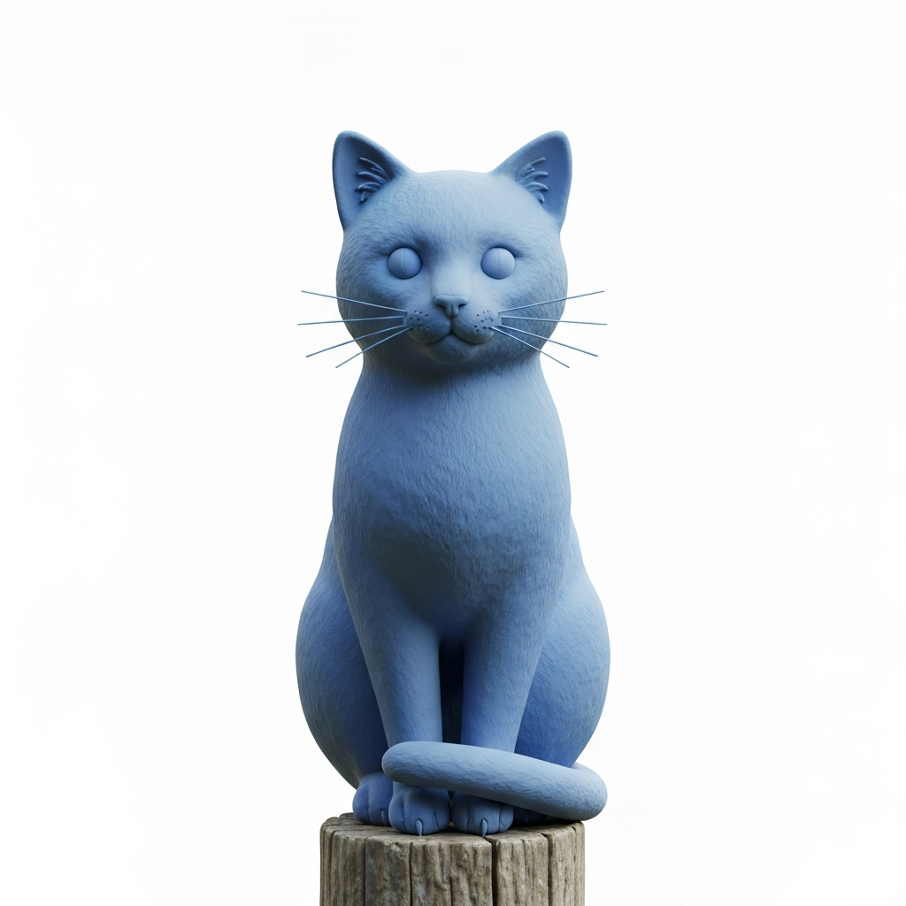<br><em>Image input</em></td>
<td align="center">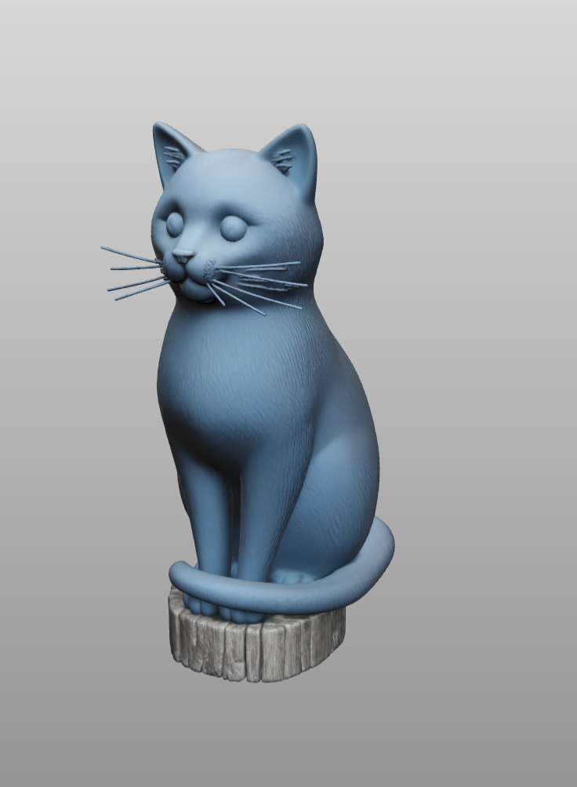<br><em>Maillage généré avec TRELLIS.2</em></td>
</tr></table>

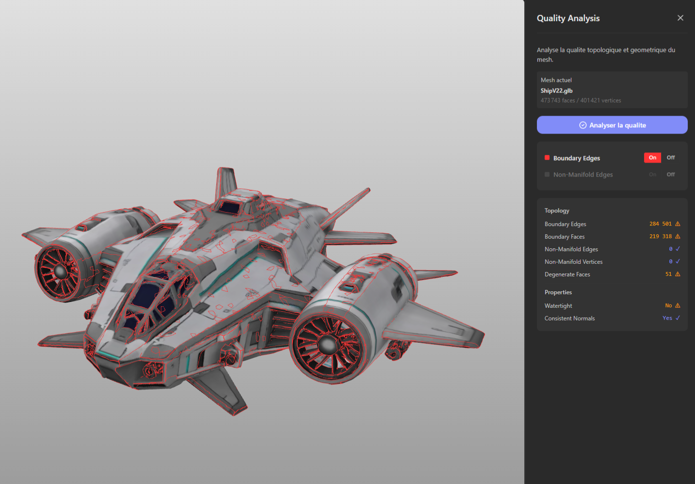<br><em>Panel Quality Analysis — détection automatique non-watertight</em>

---

### Simplification de mesh

Réduit le nombre de triangles d'un mesh en préservant la forme. L'algorithme est le Quadric Error Metric (QEM) — pour chaque vertex supprimé, il minimise l'erreur géométrique introduite. Trois niveaux : Basse (garde 70%), Moyenne (garde 50%), Forte (garde 20%), avec une option pour préserver les bords.

Deux limitations à noter. Les textures sont perdues après simplification : les UVs deviennent incohérents quand les vertices sont fusionnés — c'est une contrainte fondamentale du QEM, pas un bug. Sur les meshes TRELLIS.2 avec texture, le taux de réduction atteint peut être inférieur à la cible à cause du grand nombre de boundary edges.

<table><tr>
<td align="center">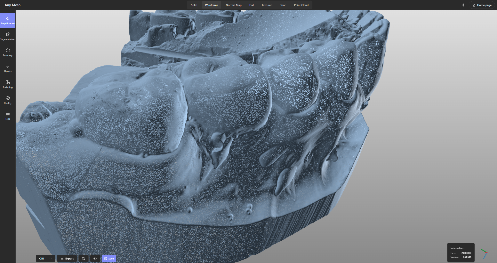<br><em>Avant — maillage dense</em></td>
<td align="center">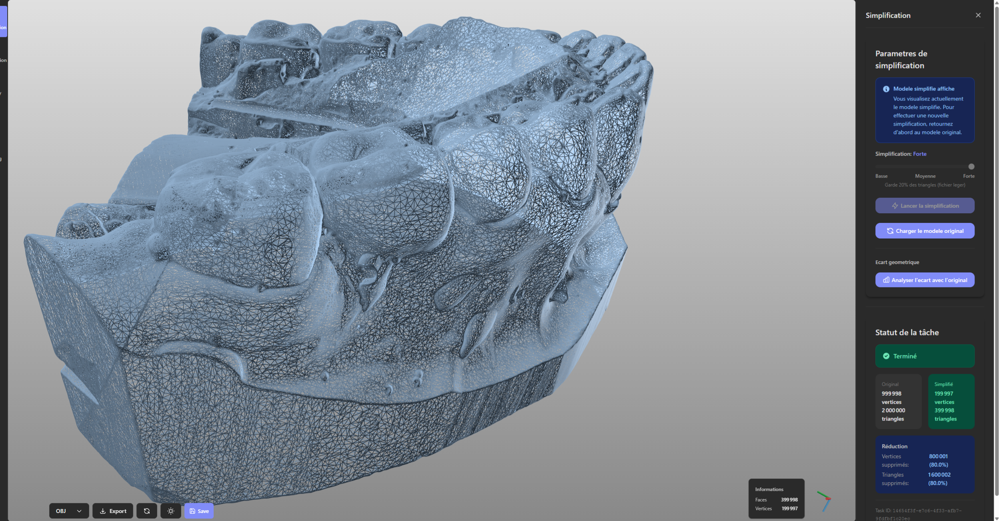<br><em>Après — 20% des faces</em></td>
</tr></table>

---

### Retopologie

Un mesh généré par IA compte souvent plusieurs centaines de milliers à quelques millions de triangles, positionnés sans structure. Pour l'animation, la subdivision ou simplement avoir un mesh propre et léger, il faut recréer la topologie depuis zéro.

L'outil utilisé est Instant Meshes (Disney Research), un remaillage field-aligned qui recrée le mesh avec une structure quad dominante, orientée selon les lignes de courbure de la surface. Le slider permet de viser entre 5% et 50% des faces originales.

Instant Meshes fonctionne bien sur des meshes propres et fermés. Les meshes TRELLIS.2 posent un problème spécifique : la reconstruction voxel par voxel ne garantit pas une surface fermée, ce qui laisse de nombreux boundary edges. Instant Meshes produit des trous sur ces meshes — problème connu (issue #78) et non résolu à ce jour. La retopologie est donc désactivée automatiquement sur ces meshes.

Une tentative de réparation a été testée : réparer le mesh avant retopo via pymeshfix pour le rendre watertight. Résultat : pymeshfix ferme les trous en reconstruisant la géométrie autour, ce qui déforme la forme originale. Approche abandonnée.

<table><tr>
<td align="center">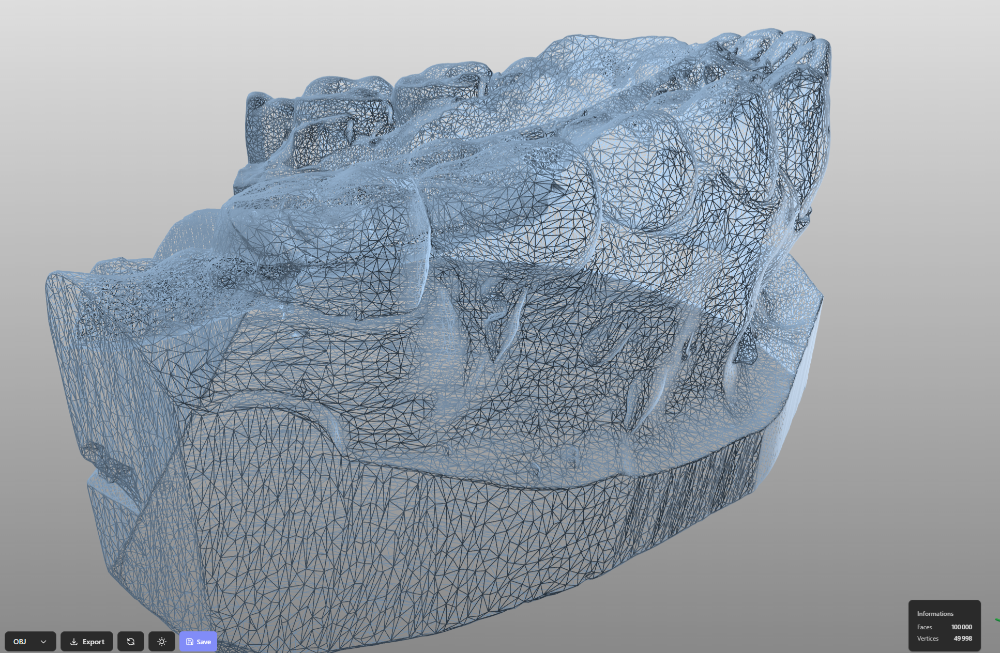<br><em>Avant — soupe de triangles</em></td>
<td align="center">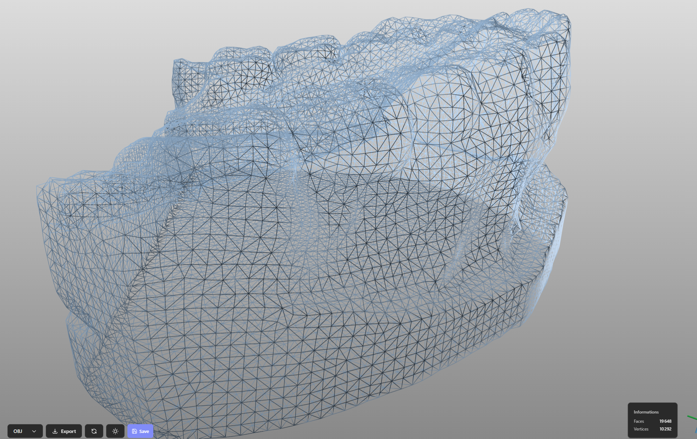<br><em>Après — structure quad-dominante</em></td>
</tr></table>

---

### Texture Baking

La retopologie recrée un mesh avec une bonne topologie, mais sans texture — la géométrie est refaite de zéro, les coordonnées UV originales ne correspondent plus à rien. Le baking transfère la texture du mesh original (high poly) vers le nouveau mesh low poly.

Pipeline : génération d'UVs sur le low poly, puis transfert de couleur depuis le high poly par recherche spatiale et interpolation barycentrique triangle par triangle.

---

### UV Unwrapping

Génère des coordonnées UV sur un mesh qui n'en a pas. Le viewer propose un mode UV checker (damier) pour visualiser la qualité de l'unwrap.

Limitations : les seams sont placés automatiquement, pas nécessairement aux endroits les plus judicieux. Sur des meshes non-manifold, l'unwrap peut produire des îles UV qui se chevauchent, ce qui provoque des artefacts de texture.

---

### Segmentation

Découpe un mesh en régions distinctes selon 4 méthodes : connectivité, arêtes vives, courbure, plans géométriques. Feature expérimentale — nécessite un mesh watertight, incompatible avec les sorties TRELLIS.2.

---

### Texturing IA

L'utilisateur entre un prompt textuel ("rusty metal" par exemple), le backend appelle Gemini Imagen qui génère une image PNG représentant la texture, puis le frontend l'applique sur le mesh via triplanar mapping : la texture est projetée depuis les trois axes (X, Y, Z) et blendée selon la normale de la surface. Aucun UV nécessaire, aucune couture visible — au prix d'un résultat générique sur les surfaces courbées.

Pour un export production, un bake de texture transfère le résultat dans le GLB — cette étape nécessite un mesh watertight.

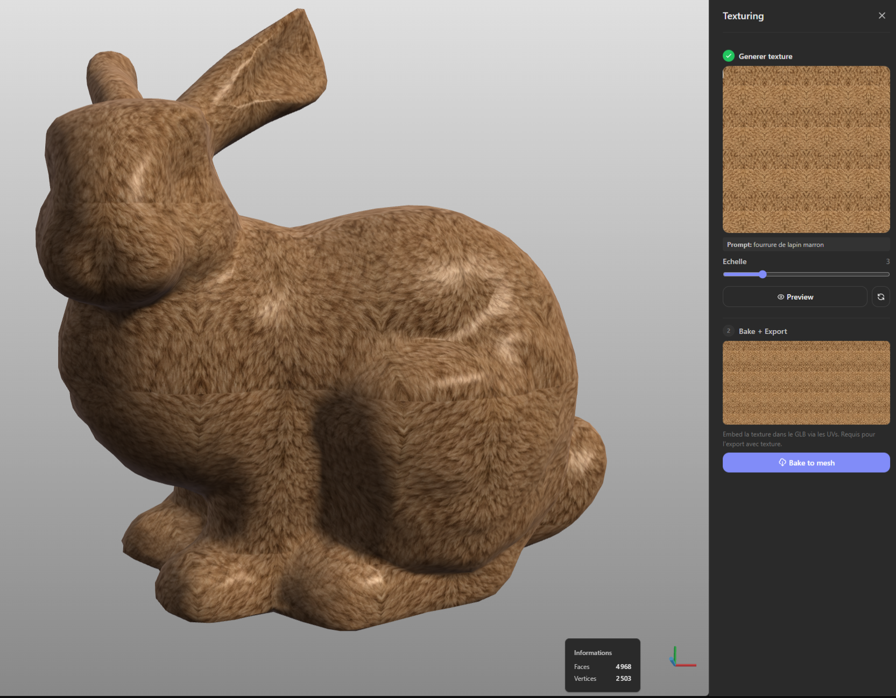<br><em>Prompt "fourrure de lapin marron" — texture appliquée directement sur le mesh</em>

---

### Physique temps réel

Feature en cours de développement. Rapier (moteur physique Rust compilé en WebAssembly, via `@react-three/rapier`) tourne dans le navigateur à 60fps sans calcul serveur. Le convex hull du mesh est extrait (simplifié à 128 vertices), utilisé comme collider, et la chute et les rebonds de l'objet sont simulés dans le viewer. Les propriétés physiques (densité, friction, restitution) peuvent être générées depuis un prompt IA.

La limite principale est le convex hull : un objet en forme de L ou de C aura un collider qui ne correspond pas à sa silhouette réelle. Une décomposition convexe (VHACD) serait plus précise mais plus coûteuse dans le navigateur.

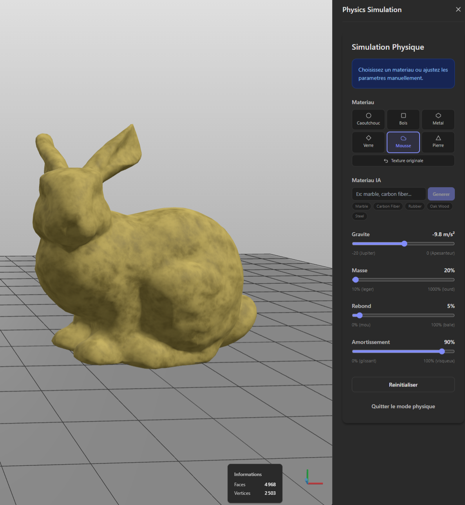<br><em>Simulation physique temps réel — matériau mousse, 60fps dans le navigateur</em>

---

## Architecture

```
Navigateur (React + R3F)
        │ REST API
        ▼
    FastAPI (VPS)
    ├── File de tâches async (thread workers)
    ├── Trimesh / PyMeshLab / SciPy
    └── Instant Meshes (subprocess C++)
        │
        └── RunPod Serverless GPU
            └── TRELLIS.2 endpoint
```

Le VPS fait tourner le backend FastAPI et sert les fichiers statiques, sans GPU. Pour TRELLIS.2, le backend soumet un job via API REST, RunPod alloue un GPU à la demande et retourne le GLB. On ne paie que le temps GPU réellement utilisé. TripoSR tourne en local sur n'importe quel GPU, sans passer par RunPod.

---

## Déploiement

Le VPS tourne Ubuntu 24.04 avec Docker. Le backend et nginx sont lancés via `docker compose up -d`. Nginx sert les fichiers statiques React et proxie les requêtes API vers FastAPI.

La partie RunPod a nécessité plusieurs itérations. L'image TRELLIS.2 officielle dépasse 30 GB — trop lourde pour un démarrage serverless rapide. La solution retenue est une image allégée (~3-5 GB) qui charge les modèles depuis un volume persistant au démarrage du worker. Le premier démarrage (allocation GPU + chargement des modèles) prend 60-90 secondes. Le backend gère cette attente avec un système de polling.

---

## Stack

| Couche | Technologie | Pourquoi |
|--------|-------------|----------|
| Backend | **FastAPI** | Python async, typage Pydantic, doc API auto-générée |
| Géométrie 3D | **Trimesh** | Chargement natif GLB/GLTF, analyse topologique |
| Géométrie 3D | **PyMeshLab** | Triangulation des N-gons produits par Instant Meshes |
| Simplification | **pyfqmr** | QEM avec preserve_border — meilleur contrôle que l'implémentation Trimesh |
| Calcul numérique | **SciPy / NumPy** | Recherche spatiale et calcul numérique pour le texture baking |
| Images | **Pillow** | Lecture/écriture des textures PNG |
| Remaillage | **Instant Meshes** | Field-aligned remeshing C++, structure quad-dominante (Disney Research) |
| Génération IA | **Gemini Imagen** | Génération de textures depuis un prompt |
| Rendu 3D | **React Three Fiber** | Binding React de Three.js |
| Helpers 3D | **@react-three/drei** | OrbitControls, Environment, ContactShadows |
| Physique | **Rapier (WASM)** | Moteur physique Rust compilé WebAssembly |
| Build frontend | **Vite** | HMR instantané, plus rapide que Webpack |
| Infra | **Docker** | Packaging du backend et isolation des dépendances |
| GPU à la demande | **RunPod Serverless** | GPU payés à l'usage |

---

## Lancement

```bash
# Backend
pip install -r requirement.txt
uvicorn src.main:app --reload --port 8000

# Frontend
cd frontend && npm install && npm run dev
```

Variables d'environnement (`.env`) :
```
RUNPOD_API_KEY=...
RUNPOD_TRELLIS_ENDPOINT_ID=...
GEMINI_API_KEY=...
```

---

## Formats supportés

**Import :** OBJ · STL · PLY · GLB · GLTF
**Export :** GLB · OBJ · PLY · ZIP (LODs)

---

## Exemples

<table><tr>
<td align="center">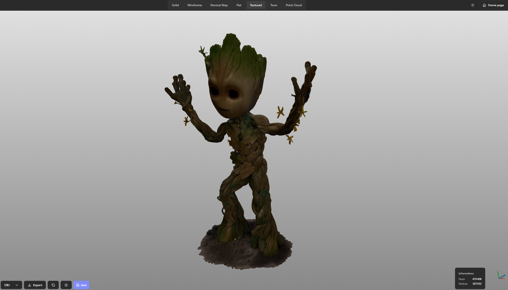<br><em>Groot</em></td>
<td align="center">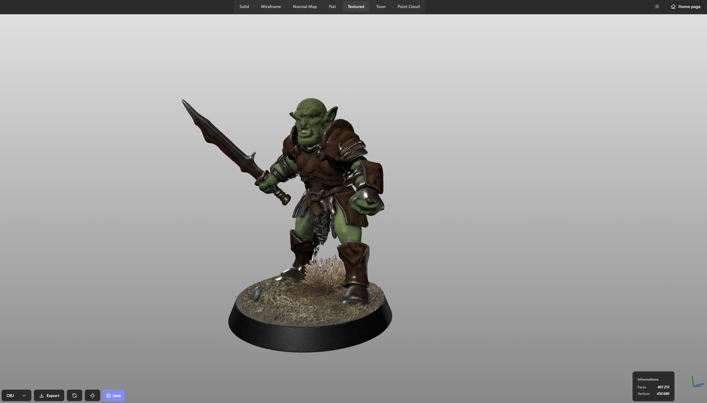<br><em>Orc</em></td>
<td align="center">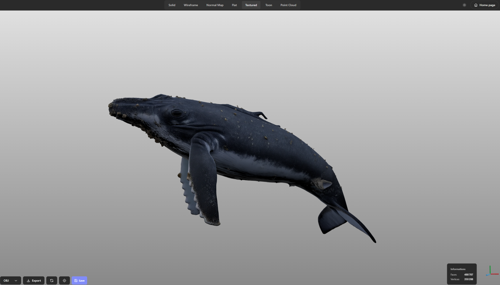<br><em>Baleine</em></td>
</tr><tr>
<td align="center">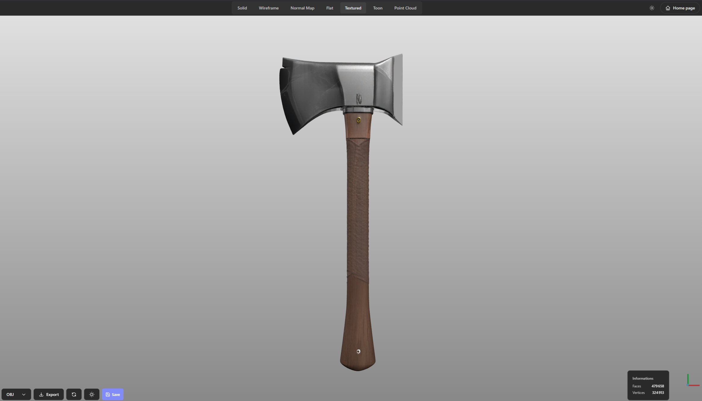<br><em>Hache</em></td>
<td align="center">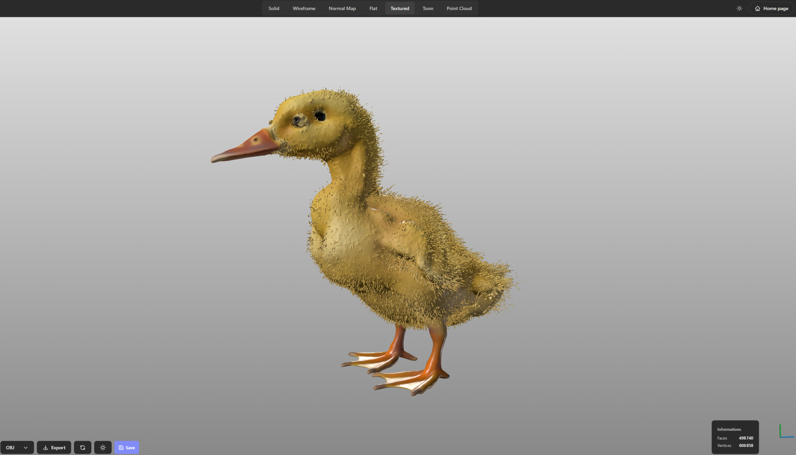<br><em>Canard</em></td>
<td></td>
</tr></table>
